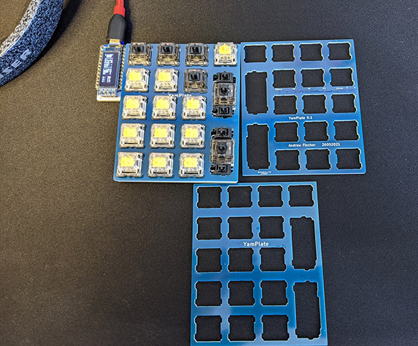

# YamPlate

YamPlate is an FR4 plate for mattdibi's YamPad. The original plate goes around the display, which I didn't want.

## See Also
https://github.com/mattdibi/yampad

## ToDo
Add access holes for the mounting screws on the YamPad. 
The slots for the 2U keys are not pretty. 

## History
Rev 0.1 is unit tested for fit but does not have holes to access the mounting screws. 

## Disclaimer
:warning:  The files are provided as is.  I do not warrant the accuracy, completeness or suitabilty of the information in this repository.  
<b>JLCPCB may impose a surcharge to manufacture this board. </b>

## License

Copyright (c) 2021 Andrew Fischer  
 This work is licensed under a <a rel="license" href="http://creativecommons.org/licenses/by-nc/4.0/">Creative Commons Attribution-NonCommercial 4.0 International License</a>.

You are free to: 
Share — copy and redistribute the material in any medium or format 
Adapt — remix, transform, and build upon the material 
The licensor cannot revoke these freedoms as long as you follow the license terms.
Under the following terms: 
Attribution — You must give appropriate credit, provide a link to the license, and indicate if changes were made. You may do so in any reasonable manner, but not in any way that suggests the licensor endorses you or your use.
 
<b>NonCommercial</b> — You may not use the material for commercial purposes. 

No additional restrictions — You may not apply legal terms or technological measures that legally restrict others from doing anything the license permits.

